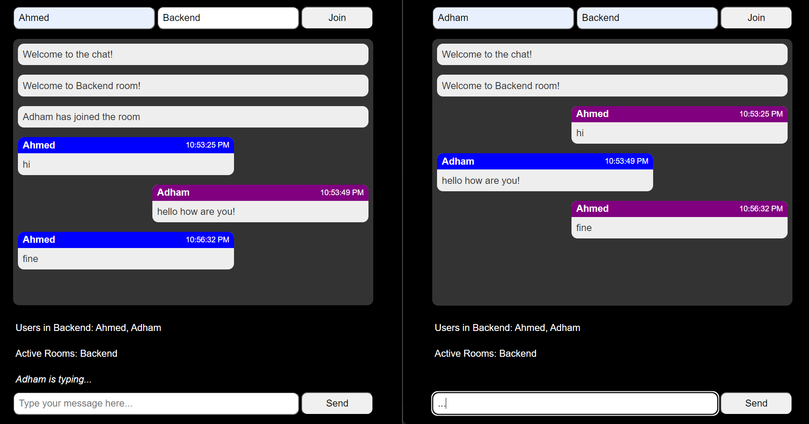

# ChitChat

ChitChat is a real-time chat application built to facilitate seamless communication across multiple chat rooms. Leveraging Socket.IO for real-time bidirectional communication, Express.js for server-side logic, and vanilla JavaScript for an interactive client-side experience, ChitChat delivers a robust and user-friendly chatting platform.

[](https://nodejs.org)
[](https://expressjs.com)
[](https://socket.io)
[](https://developer.mozilla.org/en-US/docs/Web/JavaScript)
[](https://developer.mozilla.org/en-US/docs/Web/HTML)
[](https://developer.mozilla.org/en-US/docs/Web/CSS)

## Table of Contents

- [Features](#features)
- [Installation](#installation)
- [Usage](#usage)
- [Screenshots](#screenshots)
- [Technologies Used](#technologies-used)
- [Documentation](#documentation)
- [Future Improvements](#future-improvements)
- [Contributing](#contributing)
- [Contact](#contact)

---

## Features

- **Multi-Room Chat**: Users can join distinct chat rooms to engage in group-specific conversations.
- **Real-Time Messaging**: Messages are transmitted and displayed instantly using WebSocket technology.
- **User Identification**: Users enter a name and room to participate in the chat.
- **Typing Indicators**: Visual cues notify users when someone is typing a message.
- **Dynamic User List**: Displays an up-to-date list of users currently in the room.
- **Active Room List**: Shows all currently active chat rooms.
- **System Notifications**: Admin messages inform users of joins, leaves, and welcomes.
- **Responsive UI**: Adapts seamlessly to various screen sizes for a consistent experience.
- **Activity Feedback**: Displays typing activity with a timeout to clear idle states.
- **Message Styling**: Differentiates between user messages, replies, and system notifications with distinct visual styles.
- **Room Switching**: Users can leave one room and join another, with appropriate notifications.
- **Connection Management**: Handles user connections and disconnections with error logging.

---

## Installation

To set up ChitChat locally, follow these steps:

1. Clone the repository:

   ```bash
   git clone https://github.com/yourusername/chitchat.git
   ```

2. Navigate to the project directory:

   ```bash
   cd chitchat
   ```

3. Install dependencies:

   ```bash
   npm install
   ```

4. Start the server:

   ```bash
   npm start
   ```

5. Open your browser and visit `http://localhost:3000`.

---

## Usage

1. Enter your name and desired room name in the join form.
2. Click "Join" to enter the chat room.
3. Type a message in the input field and click "Send" to broadcast it to the room.
4. Observe the user list and active rooms, and type indicators in real-time.
5. Leave and join different rooms as needed; the system will notify others accordingly.

---

## Screenshots


_Caption: A snapshot of ChitChat in action, showcasing the chat interface and user interactions._

---

## Technologies Used

- **Backend**: Node.js, Express.js, Socket.IO
- **Frontend**: HTML, CSS, JavaScript
- **Real-Time Communication**: WebSocket via Socket.IO

---

## Documentation

For full technical documentation, architecture, and API references, visit:  
[](https://deepwiki.com/AhmedElKhoriby/chat-app)

---

## Future Improvements

- **Persistent User Authentication**: Implement a login system with JWT or OAuth for secure user sessions.
- **Private Messaging**: Enable one-to-one messaging between users within or across rooms.
- **Message Persistence**: Integrate a database (e.g., MongoDB) to store and retrieve chat history.
- **File Sharing**: Allow users to upload and share files securely within rooms.
- **Rich Media Support**: Add emojis, GIFs, and message reactions for a richer user experience.
- **Push Notifications**: Implement browser notifications for new messages when the app is in the background.
- **Moderation Features**: Introduce roles (e.g., moderators) with tools to mute or ban users.
- **Multi-Language Support**: Add internationalization (i18n) for broader accessibility.
- **Theme Customization**: Offer light and dark mode options with a toggle feature.
- **Scalability Enhancements**: Optimize the server for high concurrency using clustering or load balancing.

---

## Contributing

Contributions are welcome! Feel free to fork the repository, submit pull requests, or open issues for suggestions and bug reports.

---

## Contact

For inquiries or feedback, reach out at [ahmedelkhoriby010@gmail.com].

---
